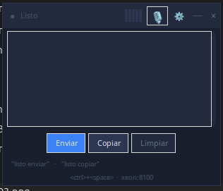

# 🎙 Dictado por Voz en Español

Widget flotante de dictado por voz para Linux.  
Captura audio del micrófono, lo envía a un servidor Vosk vía WebSocket y
transcribe el texto en tiempo real directamente en la pantalla.

**Autor:** enlinea777@gmail.com  
**Licencia:** [GNU General Public License v3.0](https://www.gnu.org/licenses/gpl-3.0.html)  
**Servidor backend:** https://github.com/enlinea777/docker_vos_a_texto

---

## ¿Qué hace este programa?

- Muestra una **ventana flotante sin bordes** siempre visible sobre otras ventanas.
- Al presionar **Ctrl+Space** (o el atajo configurado) comienza a grabar.
- El audio se envía al servidor Vosk mediante WebSocket y la transcripción
  aparece en tiempo real dentro del widget.
- Admite **comandos de voz**:
  - `"listo enviar"` → escribe el texto transcrito donde esté el cursor del sistema.
  - `"listo copiar"` → copia el texto al portapapeles.
- El texto puede **editarse manualmente** haciendo clic en el área de transcripción.
- Incluye **icono en bandeja del sistema** (clic derecho → Mostrar/Ocultar o Salir).
- Los logs se guardan en `~/.config/vosk-dictado/dictado.log`.

---

## Interfaz





- **●** — indicador de estado (gris = listo, verde = grabando, rojo = error).
- **VU** — medidor de nivel de audio en tiempo real (5 barras verticales).
- **🎙** — inicia o detiene la grabación.
- **⚙** — abre la configuración (servidor, puerto, atajo, créditos).
- **─ / ×** — ocultan la ventana (el proceso sigue corriendo en bandeja).

---

## Requisitos del sistema

```bash
sudo apt install python3-tk python3-venv xdotool xclip libportaudio2
```

| Dependencia | Versión mínima | Licencia |
|---|---|---|
| Python 3 | 3.9 | PSF |
| Tkinter / Tcl-Tk | incluido | Tcl |
| sounddevice | ≥ 0.4.6 | MIT |
| websocket-client | ≥ 1.6.0 | Apache 2.0 |
| numpy | ≥ 1.24 | BSD 3-Clause |
| pynput | ≥ 1.7.6 | LGPLv3 |
| python-xlib | ≥ 0.33 | LGPLv2+ |
| pystray | ≥ 0.19 | LGPLv3 |
| Pillow | ≥ 9.0 | HPND |
| pyperclip | ≥ 1.8.2 | BSD 3-Clause |
| xdotool | cualquiera | MIT |

---

## Instalación

### Opción A — Paquete `.deb` (Ubuntu / Debian)

```bash
# 1. Construir el paquete
cd vosk-dictado
./build-deb.sh

# 2. Instalar
sudo dpkg -i deb-build/dictado_1.0.0_all.deb
sudo apt-get install -f   # instala dependencias del sistema si faltan

# 3. Ejecutar
dictado
# o desde el menú de aplicaciones: "Dictado por Voz"
```

El instalador crea automáticamente el entorno virtual Python en
`/var/lib/dictado/venv` e instala todas las dependencias pip.

### Opción B — Script portable (sin instalación)

```bash
./dictado-portable.sh
```

Extrae `dictado.py`, instala un venv local si no existe, y ejecuta el programa.

### Opción C — Desde fuente

```bash
cd vosk-dictado
./install.sh      # crea venv y pip install
./run.sh          # lanza el programa
```

---

## Configuración

Al hacer clic en **⚙** se abre el diálogo de configuración:

| Campo | Valor por defecto | Descripción |
|---|---|---|
| Host / IP | `xeon` | Hostname o IP del servidor backend |
| Puerto | `8085` | Puerto HTTP/WS del node-gateway |
| Combinación | `<ctrl>+<space>` | Atajo global para iniciar/detener |

El archivo de configuración se guarda en `~/.config/vosk-dictado/config.ini`.

---

## Servidor backend — ¿A dónde se conecta?

El programa se conecta al **node-gateway** del proyecto
[docker_vos_a_texto](https://github.com/enlinea777/docker_vos_a_texto) mediante:

```
WebSocket:  ws://HOST:PUERTO/ws
Health:     http://HOST:PUERTO/health
```

### Opción 1 — Servidor Docker local (recomendado para uso privado)

```bash
git clone https://github.com/enlinea777/docker_vos_a_texto
cd docker_vos_a_texto
docker compose up -d
```

El servidor queda disponible en `ws://localhost:8085/ws`.  
Requiere **mínimo 1 GB de RAM** para el modelo Vosk español v0.42.

Luego configura el cliente:
- Host: `localhost`
- Puerto: `8085`

### Opción 2 — Servicio público (disponible en línea)

El servidor está disponible públicamente en:

```
ws://asistente.nxd.cl:8100/ws       (HTTP/WS)
```

Configura el cliente con el host y puerto que corresponda a tu instalación.

### Arquitectura del servicio

```
[dictado.py]
    │
    │  WebSocket (audio PCM 16-bit, 16 kHz, mono)
    ▼
[node-gateway  :8100]          ← Node.js, expuesto al exterior
    │
    │  WebSocket interno
    ▼
[vosk-server   :2700]          ← Vosk STT (solo interno, no expuesto)
    │
    ▼
transcripción en texto  →  node-gateway  →  dictado.py
```

| Puerto | Protocolo | Descripción |
|---|---|---|
| 8100 | HTTP / WS | Comunicación principal con el cliente |
| 2700 | WS interno | Vosk STT (solo dentro del contenedor) |

---

## Formato de audio

| Parámetro | Valor |
|---|---|
| Formato | PCM lineal 16-bit |
| Frecuencia de muestreo | 16 000 Hz |
| Canales | Mono |
| Codificación | Little-endian |

---

## Comandos de voz

| Frase | Acción |
|---|---|
| `"listo enviar"` | Escribe el texto transcrito en la ventana activa del sistema |
| `"listo copiar"` | Copia el texto al portapapeles y oculta la ventana |

---

## Archivos del proyecto

```
vosk-dictado/
├── dictado.py            # Programa principal (Python + Tkinter)
├── run.sh                # Script de lanzamiento (venv local)
├── install.sh            # Instalador de dependencias en venv local
├── requirements.txt      # Dependencias pip
├── build-deb.sh          # Genera el paquete .deb instalable
├── dictado-portable.sh   # Script portable autocontenido
└── README.MD             # Este archivo
```

---

## Solución de problemas

| Síntoma | Causa probable | Solución |
|---|---|---|
| `Error: No se puede alcanzar http://...` | Servidor apagado o IP/puerto incorrectos | Verificar host/puerto en ⚙ |
| Sin audio / VU no reacciona | Micrófono no disponible o driver ALSA | `arecord -l` para listar dispositivos |
| Ventana no aparece al presionar hotkey | Conflicto con otro programa | Cambiar la combinación en ⚙ |
| El texto no se escribe en otro programa | `xdotool` no instalado | `sudo apt install xdotool` |
| Icono en bandeja no aparece | GNOME sin extensión AppIndicator | Instalar "AppIndicator and KStatusNotifierItem Support" |

Los logs detallados están en `~/.config/vosk-dictado/dictado.log`.

---

## Créditos y licencias de componentes

Este proyecto es software libre distribuido bajo **GNU GPL v3**.

| Componente | Proyecto | Licencia |
|---|---|---|
| Reconocimiento de voz | [Vosk](https://alphacephei.com/vosk/) (modelo es v0.42) | Apache 2.0 / CC BY-NC-ND 4.0 |
| Node.js Gateway | [docker_vos_a_texto](https://github.com/enlinea777/docker_vos_a_texto) | GNU GPLv3 |
| Python 3 | python.org | PSF License |
| Tkinter / Tcl-Tk | tcl.tk | Tcl License |
| sounddevice | spatialaudio/python-sounddevice | MIT |
| websocket-client | websocket-client/websocket-client | Apache 2.0 |
| NumPy | numpy.org | BSD 3-Clause |
| pynput | moses-palmer/pynput | LGPLv3 |
| python-xlib | python-xlib/python-xlib | LGPLv2+ |
| pystray | moses-palmer/pystray | LGPLv3 |
| Pillow | python-pillow/Pillow | HPND |
| pyperclip | asweigart/pyperclip | BSD 3-Clause |
| xdotool | jordansissel/xdotool | MIT |

```
Copyright (C) 2026  enlinea777@gmail.com

Este programa es software libre: puedes redistribuirlo y/o modificarlo
bajo los términos de la Licencia Pública General de GNU publicada por
la Free Software Foundation, versión 3 cualquier
versión posterior.

Este programa se distribuye con la esperanza de que sea útil,
pero SIN NINGUNA GARANTÍA; sin incluso la garantía implícita de
COMERCIABILIDAD o IDONEIDAD PARA UN PROPÓSITO PARTICULAR.
Consulta la GNU GPL para más detalles: https://www.gnu.org/licenses/
```
